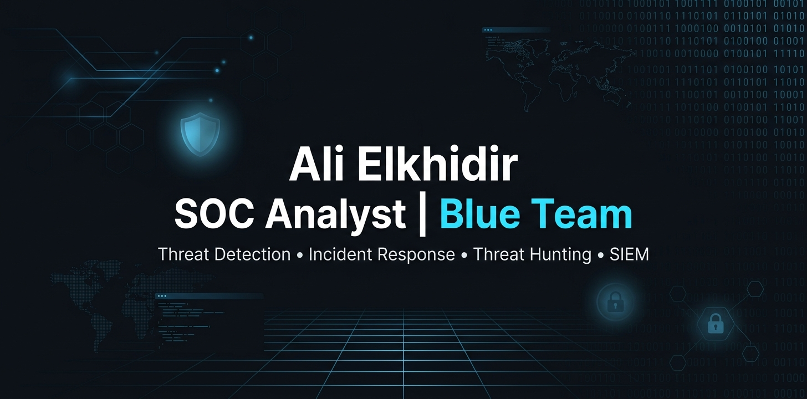

  

# Hi, I'm Ali 👋

**Cybersecurity | SOC Analyst | Blue Team**

---

## 👨‍💻 About Me

I'm a cybersecurity learner passionate about Blue Team operations, Security Operations Centers (SOC), and Threat Detection.

I'm continuously improving my skills through hands-on labs, certifications, and practical security projects.

---

## 🎯 Currently Learning

- CompTIA Security+
- Splunk
- Microsoft Sentinel
- Threat Hunting
- Incident Response

---

## 🛠️ Tech Stack

## 🚀 Projects

### 🛡️ SOC Labs

Hands-on cybersecurity labs covering:

- Security Operations
- Threat Detection
- Incident Response
- Log Analysis
- Blue Team Techniques

🔗 [View SOC-Labs Repository](ضع-الرابط-هنا)

## 📜 Certifications

- ✅ ISC2 Certified in Cybersecurity (CC)
- ✅ Google Cybersecurity Professional Certificate
- ✅ IBM Cybersecurity Analyst
- ⏳ CompTIA Security+ (In Progress)

---

## 📫 Contact

- LinkedIn: *(ضع الرابط لاحقًا)*
- Email: *(ضع بريدك لاحقًا)*
